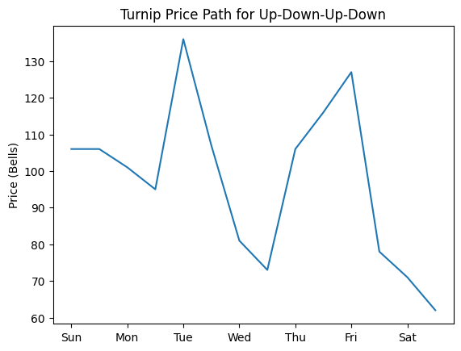
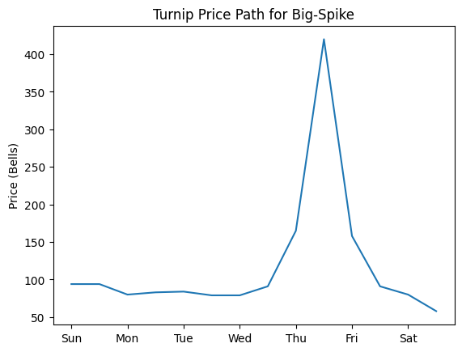
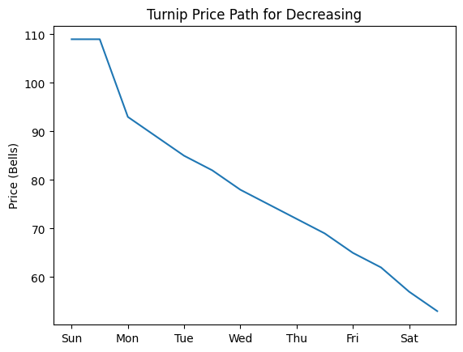
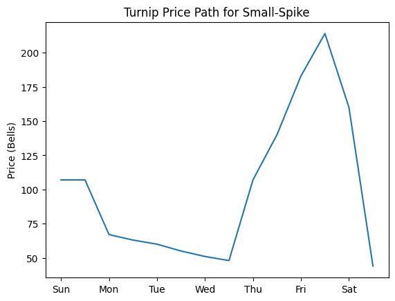
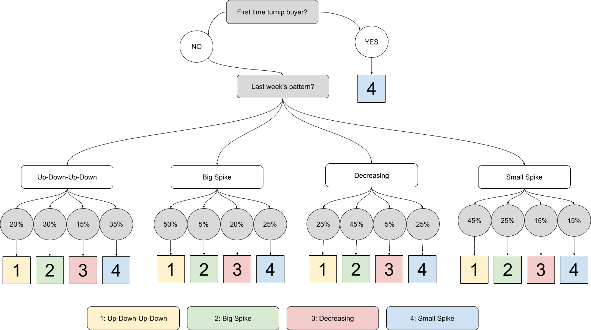

# The Stalk Market

## Introduction
In Animal Crossing, one of the most well-known ways to make lots of money is known as the Stalk Market, or the Turnip Exchange.
Every Sunday morning, a young boar named Daisy Mae visits every player's island, offering turnips for a price between 90 and 100 Bells. Turnips can only be purchased on Sunday morning, and cannot be sold until Monday.
Starting Monday morning, the game begins. Every 12 hours until next Sunday, players are able to see the current selling value of turnips, and then determine whether to sell their turnips now, or to hold on to them for later. However, the turnips will spoil on the next Sunday morning, rendering them unusable. With these stakes, players are left to determine the best time every week to sell their turnips to get some profit. This leaves a lot of uncertainty to the player.

## Four Patterns
However, there isn't nearly as much uncertainty as one might think. GitHub user Treeki reverse-engineered the source code in the game's files to figure out the exact patterns that turnip prices follow, and they found four concrete patterns that the turnip prices follow, as well as the exact decision tree used in deciding which of those four patterns is used on any given week. Each pattern's prices are based on the base price of the turnips on that Sunday morning.
The patterns go as follows:

__Up-Down-Up-Down - 5 Phases:__

| __Phase__ | __Length__ | __Description__ |
|-----------|------------|-----------------|
| A | 0-6 Steps | 90-140% of base price |
| B | 2-3 Steps | 60-80% of base price, then decreasing by 4-10% of base price |
| C | 1-(7 - A) Steps | 90-140% of base price |
| D | 1-(3 - B) Steps | 60-80% of base price, then decreasing by 4-10% of base price |
| E | (7 - A - C) Steps | 90-140% of base price |

__Big Spike - 5 Phases:__

| __Phase__ | __Length__ | __Description__ |
|-----------|------------|-----------------|
| A | 1-7 Steps | Start at 85-90% of base price, then decreasing by 3-5% of base price |
| B | 2 Steps | 90-140% of base price, then 140-200% of base price |
| C | 1 Step | 140-200% of base price, then 90-140% of base price |
| D | 2 Steps | 140-200% of base price, then 90-140% of base price |
| E | (7 - A) Steps | 40-90% of base price |

__Decreasing - 1 Phase:__

| __Phase__ | __Length__ | __Description__ |
|-----------|------------|-----------------|
| A | 12 Steps | Start at 85-90% of base price, then decreasing by 3-5% of base price |

__Small Spike - 6 Phases:__

| __Phase__ | __Length__ | __Description__ |
|-----------|------------|-----------------|
| A | 0-7 Steps | Start at 40-90% of base price, then decreasing by 3-5% of base price |
| B | 2 Steps | 90-140% of base price |
| C | 1 Step | Between 140% of base price and the Phase D price |
| D | 1 Step | 140-200% of base price |
| E | 1 Step | Between 140% of base price and the Phase D price |
| F | (7 - A) Steps | 40-90% of base price, then decreasing by 3-5% of base price |

## Decision Tree
The turnip price patterns are selected by a simple decision tree, where the odds of a pattern being selected is dependent on what the previous pattern was. [Michael Goldstein](https://mgold.io/2020/05/20/forecasting-turnip-prices.html#fnref:1) provided the following flowchart on his blog page:

## Optimal Stopping
An interesting thing to note is how this knowledge affects where we might stop and sell our turnips every week. Running simulations on the decision tree every week for 

## Conclusion and Application
By simply knowing what last week's pattern was, we know the probabilities of each pattern occuring this week. A player can use these probabilities as they use Bayesian inference over the first few time steps of a week to determine what pattern they're on, and then sell quickly if it's a decreasing pattern or recognize when to sell if it's going to be a big spike. 

